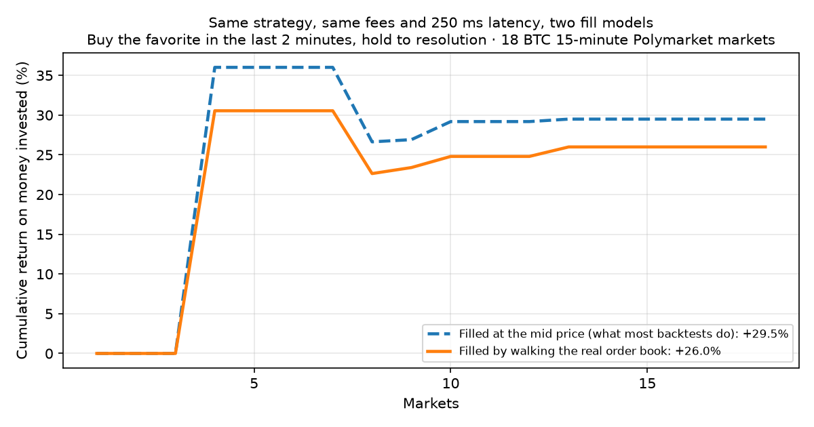

# resolvedkit: a Polymarket backtester

**Backtest Polymarket strategies against the real order book.** Orders fill by walking the L2 ladder,
fees follow Polymarket's taker-fee curve, orders land after a realistic delay, and positions settle at
the market's actual resolution. It ships with sample data, so it runs straight after `pip install`, with
no API key.



Most prediction-market backtests fill at the mid price. That price is not one you can trade at: a
market buy pays the ask, walks up the book when the size is larger than the best level, and pays a
taker fee on top. On the bundled sample, the same strategy with the same fees returns **+29.5%** when
filled at the mid and **+26.0%** when filled against the book. That gap is often an entire edge.

```bash
pip install resolvedkit
resolvedkit run late_favorite --compare-mid
```

## What it models

- **Book-walking fills.** Buys lift asks level by level and sells hit bids. A price limit caps the
  walk, and partial fills are flagged when the book runs out. Mid-price fills exist only as an explicit
  `fill_model="mid"`, to measure how much they overstate.
- **Polymarket fees.** `shares × rate × p × (1 − p)` is charged per matched level, with the rate for
  each category (crypto 0.07, sports 0.05, and so on).
- **Latency.** An order fills against the book standing `latency_ms` after it was placed (250 ms by
  default), not the book that triggered it.
- **Settlement.** Shares still held at the end pay out the market's resolved price, 1 or 0 per share, or
  a fraction for split outcomes. Unresolved markets are marked at the last mid and counted in
  `unresolved_markets`.
- **Placeholder books.** Freshly listed markets often show a 0.01 / 0.99 book before real quoting
  starts. Orders against it are rejected rather than filled at 0.99.
- **Metrics.** Results include PnL, return on money invested, fees, win rate, partial fills, average
  slippage against the mid, and the Brier score of entry prices.

## Two ways to write a strategy

**JSON spec**, with no code, which also makes it easy for an AI agent to write one:

```json
{
  "name": "Buy the favorite in the last 2 minutes, take 5 cents or stop at 10",
  "entry": {"side": "favorite", "seconds_before_end": 120, "min_price": 0.6, "max_price": 0.9,
            "usd": 250, "max_slippage": 0.02},
  "exit": {"take_profit": 0.05, "stop_loss": 0.10}
}
```

`side` is `UP`, `DOWN`, `favorite` or `underdog`. Without `exit`, the position is held to resolution.
Save it as `my_strategy.json` and run `resolvedkit run my_strategy.json`. Two examples are
bundled: `late_favorite` and `early_underdog_scalp`.

**Python**, for anything else:

```python
from resolvedkit import UP, Backtester, Strategy, load_sample

class DepthImbalance(Strategy):
    def on_book(self, ctx, book):
        if book.side != UP or ctx.state.get("entered") or not book.two_sided:
            return
        bid_depth = sum(l.size * l.price for l in book.bids[:5])
        ask_depth = sum(l.size * l.price for l in book.asks[:5])
        if 60 < ctx.seconds_to_end < 600 and bid_depth > 3 * ask_depth:
            ctx.buy(UP, usd=100, max_price=book.best_ask + 0.02)
            ctx.state["entered"] = True

print(Backtester(load_sample(), DepthImbalance()).run().summary())
```

`on_book` is called for every snapshot of either outcome token, in time order. `ctx` provides:
- `book(side)`, `position(side)`, `now` and `seconds_to_end`
- `buy(side, usd, max_price)` and `sell(side, shares, min_price)`
- `state`, a dict that resets for each market

## Data

| Source | Use |
|---|---|
| `load_sample()` | 18 settled BTC 15-minute markets, bundled (CC BY 4.0) |
| `ResolvedMarketsAPI(crypto="BTC", timeframe="15m", limit=50)` | Historical Polymarket order books from [Resolved Markets](https://resolvedmarkets.com). A free API key covers recent crypto markets; paid plans add full history plus sports, weather, equities and economics. |
| `ParquetSource("folder/")` | Your own data in the documented [two-file Parquet layout](src/resolvedkit/data/parquet.py) |

```bash
export RESOLVED_MARKETS_API_KEY=rm_...   # free key: https://resolvedmarkets.com/api-keys
resolvedkit run late_favorite --data api --crypto ETH --timeframe 5m --limit 50
```

The sample is thinned to one snapshot per side per second and the top 20 levels. The API serves every
snapshot at full depth.

## Honest limits

- Rejected or partly filled orders are retried by the JSON rules on the next snapshot; in Python
  strategies, check `ctx.pending_orders()` and your position yourself.
- Your orders don't move the book: each fill walks the snapshot as recorded, and later snapshots don't
  reflect your trades. For small size relative to depth this is close; for large size it's optimistic.
- Resting (maker) orders aren't simulated yet, since queue position isn't in snapshot data. All fills
  are taker fills.
- 18 sample markets are enough to show the mechanics, not to prove a strategy. Run on hundreds.

## Roadmap

Kalshi fees and data adapter · maker orders with queue estimates · wallet-replay (copy-trading)
backtests · an MCP server so agents can run backtests.

## License

Code: MIT. Sample data: CC BY 4.0, see [DATA_LICENSE](DATA_LICENSE).
